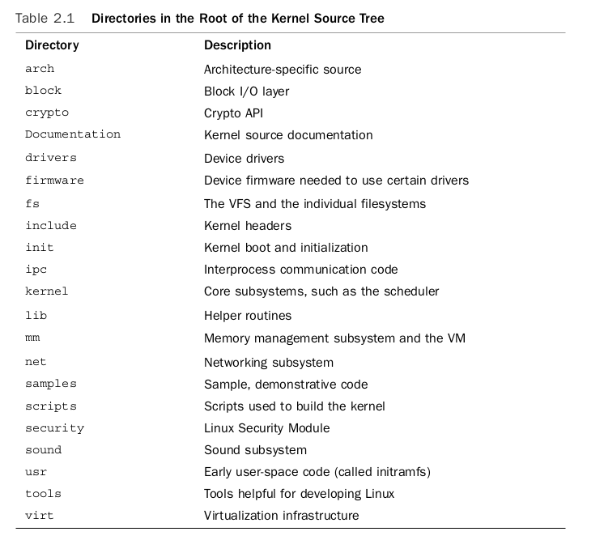

# ch2 notes

### Getting Started with the Kernel
- Obtaining the Kernel Source
    - Using Git
    - Installing the Kernel Source
    - Using Patches
- The Kernel Source Tree
- Building the Kernel
    - Configuring the Kernel
    - Minimizing Build Noise
    - Spawning Multiple Build Jobs
    - Installing the New Kernel
- A Beast of a Different Nature
    - No libc or Standard Headers
    - GNU C
        - Inline Functions
        - Inline Assembly
        - Branch Annotation
    - No Memory Protection
    - No (Easy) Use of Floating Point
    - Small, Fixed-Size Stack
    - Synchronization and Concurrency
    - Importance of Portability
- Conclusion

---

#### Obtaining the Kernel Source
- I install Ubuntu trusty on VM and setup kernel 2.6.26 on Qemu
- Still need to using some debug methods

---

#### The Kernel Source Tree

- Notes :
  - lib contain implementaion to some libc function to not using this libc in kernel space 

---

#### Building the Kernel
- Configuring the kernel is a required step before building it.
- Kernel configuration is controlled by configuration options, which are prefixed by CONFIG in the form CONFIG_FEATURE. For example, sym- metrical multiprocessing (SMP) is controlled by the configuration option CONFIG_SMP. If this option is set, SMP is enabled; if unset, SMP is disabled.
  - The configure options are used both to decide which files to build and to manipulate code **via preprocessor directives.**
- Configuration options that control the build process are either Booleans or tristates.
- Configuration options can also be strings or integers.
  - These options do not control the build process but instead specify values that kernel source can access as a preprocessor macro. **For example**, a configuration option can specify the size of a statically allocated array.

---

#### A Beast of a Different Nature
- The Linux kernel has several unique attributes as compared to a normal user-space application.
- The most important of these differences are :
    - The kernel has access to neither the C library nor the standard C headers.
    - The kernel is coded in GNU C.
    - **The kernel lacks the memory protection afforded to user-space.**
    - The kernel cannot easily execute floating-point operations.
    - The kernel has a small per-process fixed-size stack.
    - Because the kernel has asynchronous interrupts, is preemptive, and supports SMP, synchronization and concurrency are major concerns within the kernel.
    - Portability is important.

- **No libc or Standard Headers**
  - the kernel is not linked against the standard C library or any other library
    - There are multiple reasons for this, including a chicken-and-the-egg situation, but the primary reason is speed and size. 
    - Many of the usual libc functions are implemented inside the kernel. For example, the common string manipulation functions are in lib/string.c. Just include the header file <linux/string.h> and have at them.
- **GNU C**
  - the kernel is not programmed in strict ANSI C.
  - The kernel developers use both ISO C99 and GNU C extensions to the C language. 
  - **Inline Functions**
    - site.This eliminates the overhead of function invocation and return (register saving and restore) and allows for potentially greater optimiza- tion as the compiler can optimize both the caller and the called function as one. 
    - code size increases because the contents of the function are copied into all the callers, which increases memory consumption and instruction cache footprint.
    - Kernel developers use inline functions **for small time-critical functions.**
    - An inline function is declared when the keywords static and inline are used as part of the function definition. For example `static inline void wolf(unsigned long tail_size)`
    - Common practice is to place inline functions in header files. Because they are marked static, an exported function is not created.
    - If an inline function is used by only one file, it can instead be placed toward the top of just that file.
    - In the kernel, using inline functions is preferred over complicated macros for reasons of type safety and readability.
  - **Inline Assembly**
    - The gcc C compiler enables the embedding of assembly instructions in otherwise normal C functions.
    - This feature, of course, is used in only those parts of the kernel **that are unique to a given system architecture.**
    - The `asm()` compiler directive is used to inline assembly code.
    - The Linux kernel is written in a mixture of C and assembly, with assembly relegated to low-level architecture and fast path code.The vast majority of kernel code is programmed in straight C.
    - `unsigned int low, high;`
    - `asm volatile("rdtsc" : "=a" (low), "=d" (high));`
  - **Branch Annotation** 
    - The gcc C compiler has a **built-in directive** that optimizes conditional branches **as either very likely taken or very unlikely taken.**
    - The kernel wraps the directive in easy-to-use macros, `likely()` and `unlikely()`.
      - For example, consider an if statement such as the following: 

``` c
if (error) { 
    /* ... */ 
} 
To mark this branch as very unlikely taken (that is, likely not taken): 
/* we predict 'error' is nearly always zero ... */ 

if (unlikely(error)) { 
    /* ... */ 
}
```

``` c
Conversely, to mark a branch as very likely taken:
/* we predict 'success' is nearly always nonzero ... */
if (likely(success)) {
    /* ... */
}
```

- You should only use these directives when the branch direction is overwhelmingly known a priori or when you want to optimize a specific case at the cost of the other case.
- These directives result in a performance boost when the branch is correctly marked, but a performance loss when the branch is mismarked.
- A common usage, as shown in these examples, for unlikely() and likely() is error conditions.
- **As you might expect, unlikely() finds much more use in the kernel because if statements tend to indicate a special case.**

---

- **A Beast of a Different Nature**
  - **No Memory Protection**
    - When a user-space application attempts an illegal memory access, the kernel can trap the error, send the `SIGSEGV` signal, and kill the process.
    - If the kernel attempts an illegal memory access, however, the results are less controlled.
      - (After all, who is going to look after the kernel?) Memory violations in the kernel result in an `oops`, which is a major kernel error.
      - **kernel memory is not pageable.**Therefore, **every byte of memory you consume is one less byte of available physical memory.** Keep that in mind the next time you need to add one more feature to the kernel!
  - **No (Easy) Use of Floating Point** 
    - When a user-space process uses floating-point instructions, the kernel manages the transition from integer to floating point mode. **What the kernel has to do when using floating point instructions varies by architecture,** but the kernel normally catches a trap and then initiates the transition from integer to floating point mode.
    - Unlike user-space, the kernel does not have the luxury of seamless support for floating point because it cannot easily trap itself. Using a floating point inside the kernel requires manually saving and restoring the floating point registers, among other possible chores.
    - The short answer is: **Don’t do it! Except in the rare cases, no floating-point operations are in the kernel.**
  - **Small, Fixed-Size Stack**
    - User-space can get away with statically allocating many variables on the stack, including huge structures and thousand-element arrays. 
      - This behavior is legal because user-space has a large stack that can dynamically grow.
    - **The kernel stack is neither large nor dynamic;** it is **small and fixed in size.** The exact size of **the kernel’s stack varies by architecture**.
    - On x86, the stack size is configurable **at compile-time** and can be either **4KB or 8KB.**
      - Historically, **the kernel stack is two pages**, which generally implies that it is 8KB on 32-bit architectures and 16KB on 64-bit architectures—this size is fixed and absolute.
      - Each process receives its own stack.
      - Elhusseiny : what is the stack size now in x86 , ARM and other **??????**
  - **Synchronization and Concurrency** 
    - The kernel is susceptible to race conditions.
  - **Importance of Portability**
    - Linux is a portable operating system and should remain one.**This means that architecture independent C code must correctly compile and run on a wide range of systems**, and that architecture dependent code must be properly segregated in system-specific directories in the kernel source tree.
    - A handful of rules—such as remain endian neutral, be 64-bit clean, do not assume the word or page size, and so on—go a long way.


---