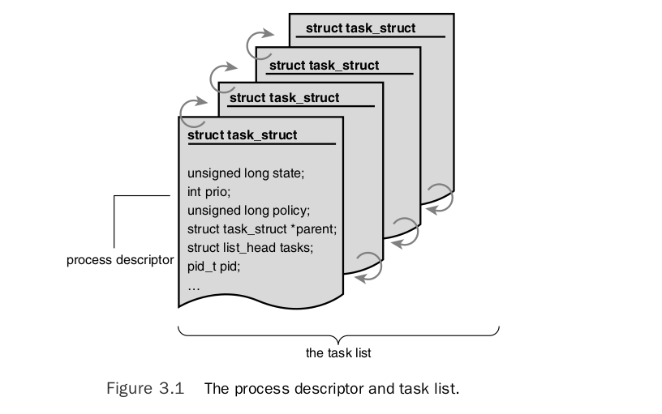
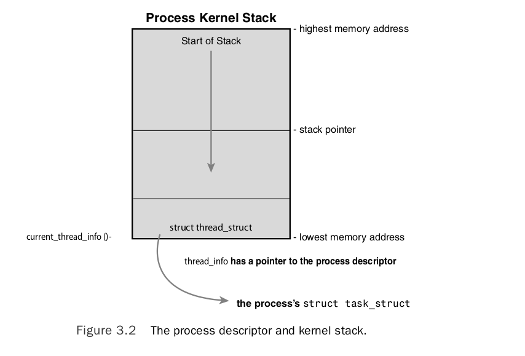
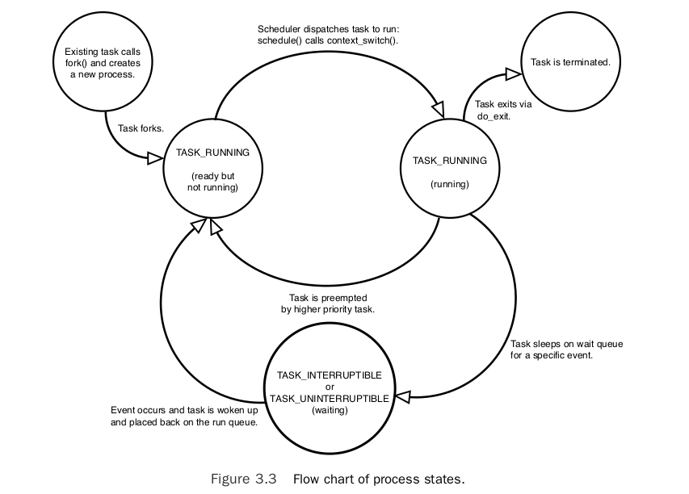
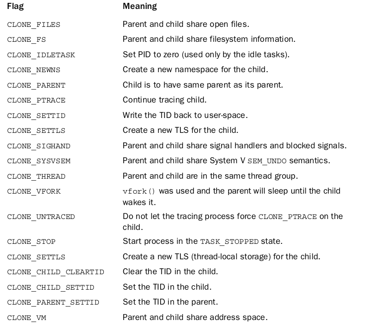

# ch3 notes

### Process Management
- The Process
- Process Descriptor and the Task Structure
  - Allocating the Process Descriptor
  - Storing the Process Descriptor
  - Process State
  - Manipulating the Current Process State
  - Process Context
  - The Process Family Tree
- Process Creation
  - Copy-on-Write
  - Forking
  - vfork()
- The Linux Implementation of Threads
  - Creating Threads
  - Kernel Threads
- Process Termination
  - Removing the Process Descriptor
  - The Dilemma of the Parentless Task
- Conclusion

---

#### The Process
- A process is a program (object code stored on some media) in the midst of execution.
  - They also include a set of resources such as **open files** and **pending signals**, **internal kernel data**, **processor state**, a **memory address space with one or more memory mappings**, **one or more threads of execution**, and a **data section containing global variables**.
- threads, are the objects of activity within the process.
  - Each thread includes a unique program counter, process stack, and set of processor registers.
  - The **kernel schedules individual threads, not processes.**
- Linux has a unique implementation of threads: It does not differentiate between threads and processes.**To Linux, a thread is just a special kind of process.**
- On modern operating systems, processes provide two virtualizations: **a virtualized processor and virtual memory.**
- Interestingly, note that **threads share the virtual memory abstraction, whereas each receives its own virtualized processor.**
  - Elhusseiny : threads in same processes see the same virtual memory, but why they don't share the same virtual process --> this lead the need to protect resources that the different threads use in the particular process.
- A program itself is not a process; **a process is an active program and related resources.**
- two or more processes can exist that are executing the same program. In fact, two or more processes can exist that share various resources, such as open files or an address space.
  - Elhusseiny : sharing using IPCs or what !???? what about child and parent relations ?? answer is below
  - this occurs by means of the `fork()` **system call**, which creates a new process by duplicating an existing one.
  - The parent resumes execution and the child starts execution at the same place: call to fork() returns.
  - The fork() system call **returns from the kernel twice:** once in the parent process and again in the newborn child.
  - Often, immediately after a fork it is desirable to execute a new, different program.The `exec()` family of function calls **creates a new address space and loads a new program into it.**
  - In contemporary Linux kernels, fork() is actually implemented via the `clone()` system call.
- a program exits via the `exit()` system call.This function terminates the process and frees all its resources. 
  - A parent process can inquire about the status of a terminated child via the `wait4()` system call.
    - which enables a process to wait for the termination of a specific process.
    - When a process exits, it is placed into a special **zombie state** that **represents terminated processes until the parent calls `wait()` or `waitpid()`.**


---
---
---

#### Process Descriptor and the Task Structure
##### Allocating the Process Descriptor

- The kernel stores the list of processes in a **circular doubly linked list called the task list.**
- Each element in the task list is a **process descriptor of the type** `struct task_struct` defined in <linux/sched.h>
- The task_struct is a relatively large data structure, at around 1.7 kilobytes on a 32-bit machine.This size, however, is quite small considering that the structure contains all the information that the kernel has and needs about a process.
  - Elhusseiny : can you use gdb to know what is it's size in different machines and archi?
- The task_struct structure is allocated via the `slab allocator` **to provide object reuse and cache coloring**!
  - cache coloring (also known as page coloring) is the process of attempting to allocate free pages that are contiguous from the CPU cache's point of view, in order to maximize the total number of pages cached by the processor. 
  - Elhusseiny : slab layer make the **kernel able to register small objects size less than page size** , It's implemented above budy system.
  - Prior to the 2.6 kernel series, struct task_struct was **stored at the end of the kernel stack of each process.**
    - This allowed architectures with few registers, such as x86, to calculate the location of the process descriptor via the stack pointer without using an extra register to store the location.
- With the process descriptor now dynamically created via the slab allocator, **a new structure,** `struct thread_info`, was created that again lives at the bottom of the stack (for stacks that grow down) and at the top of the stack (for stacks that grow up).
  - Elhusseiny : thread_info contains CPU-specific's "cpu context registers , sys call nr , ... " **so that is HW dependent.**
  - The thread_info structure is defined on x86 in <asm/thread_info.h>
  - Each task’s thread_info structure is allocated at the end **of its stack.**
  - The task element of the structure is a pointer to the task’s actual task_struct.



---

#### Storing the Process Descriptor
- The system identifies processes by a **unique process identification value or PID.**
  - The PID is a numerical value represented by the opaque type pid_t, which is typically an int.
  - the default maximum value is only 32,768 (that of a short int), although the value optionally can be increased as high as four million this is controlled in <linux/threads.h>.
  - The kernel stores this value as pid inside each process descriptor.
  - This maximum value is important because it is essentially the maximum number of processes that may exist concurrently on the system.
  - If the system is willing to break compatibility with old applications, the administrator may increase the maximum value via `/proc/sys/kernel/pid_max`.
- most kernel code that deals with processes works directly with struct task_struct. Consequently, **it is useful to be able to quickly look up the process descriptor of the currently executing task**, **which is done via the `current` macro.**
  - This macro **must be independently implemented by each architecture.**
    - Some architectures save a pointer to the task_struct structure of the currently running process in a register, enabling for efficient access. Other architectures, such as x86 (which has few registers to waste), make use of the fact that struct thread_info is stored on the kernel stack to calculate the location of thread_info and subsequently the task_struct.
      - On x86, **current is calculated by** masking out the 13 least-significant bits of the stack pointer to obtain the `thread_info structure`.This is done by the `current_thread_info()` function.The assembly is shown here:`movl $-8192, %eax` `andl %esp, %eax`
      - This assumes that the stack size is 8KB.When 4KB stacks are enabled, 4096 is used in lieu of 8192.
  - Finally, current dereferences the task member of thread_info to return the task_struct: `current_thread_info()->task;`
- Elhusseiny : You can always get current stack pointer from the platform specific stack pointer register, but you cannot find start of the stack so easily - it is just not there.
  - https://stackoverflow.com/questions/43176500/current-thread-info-inline-function-in-linux-kernel

---

#### Process State


- The state field of the process descriptor describes the current condition of the process
- Each process on the system is in exactly one of five different states.This value is represented by one of five flags:
  - `TASK_RUNNING` The process is runnable; it is either currently running or on a runqueue waiting to run (runqueues are discussed in Chapter 4).**This is the only possible state for a process executing in user-space;** it can also apply to a process in kernel-space that is actively running.
    - Elhusseiny : so the others state is not happen in user space ????
  - `TASK_INTERRUPTIBLE` The process is sleeping (that is, it is blocked), waiting for some condition to exist.When this condition exists, the kernel sets the process’s state to TASK_RUNNING.The process also awakes **prematurely** and becomes runnable **if it receives a signal.**
  - `TASK_UNINTERRUPTIBLE` This state is identical to TASK_INTERRUPTIBLE except that **it does not wake up and become runnable if it receives a signal.** 
    - This is used in situations where the process must wait without interruption or when the event is expected to occur quite quickly. Because the task does not respond to signals in this state, TASK_UNINTERRUPTIBLE is less often used than TASK_INTERRUPTIBLE.
    - This is why you have those dreaded unkillable processes with state D in ps(1). Because the task will not respond to signals, you cannot send it a SIGKILL signal.
  - `__TASK_TRACED` The process is being traced by another process, such as a debugger, via ptrace.
  - `__TASK_STOPPED` Process execution has stopped; the task is not running nor is it eligible to run.This occurs if the task receives the `SIGSTOP`, `SIGTSTP`, `SIGTTIN`, or `SIGTTOU` signal **or if it receives any signal while it is being debugged.**

---

#### Manipulating the Current Process State
- Kernel code often needs to change a process’s state.**The preferred mechanism is** using `set_task_state(task, state);` /* set task ‘task’ to state ‘state’ */
- it also provides a memory barrier to force ordering on other processors.**(This is only needed on SMP systems.)** Otherwise, it is equivalent to `task->state = state;`
- The `method set_current_state(state)` is **synonymous** to `set_task_state(current, state)`. See <linux/sched.h>

---

#### Process Context
- Normal program execution occurs in user-space. When a program executes a system call or triggers an exception, it enters kernel-space. 
  - At this point, the kernel is said to be “executing on behalf of the process” **and is in process context.**
- When in process context, the `current` macro is valid. "Other than `process context` there is `interrupt context`."
  - In interrupt context, **the system is not running on behalf of a process but is executing an interrupt handler. No process is tied to interrupt handlers.**
- System calls and exception handlers are well-defined interfaces into the kernel.
  - process can begin executing in kernel-space only through one of these interfaces all access to the kernel is through these interfaces.


---

#### The Process Family Tree
- All processes are descendants of the init process, whose PID is one. `pstree -g`
- The kernel starts init in the last step of the boot process.
  - Elhusseiny : is this the init for user space or to handle the excution tasks in kerenl space ???
  - The init process, in turn, reads the system initscripts and executes more programs, eventually completing the boot process.
- Processes that are all direct children of the same parent are called siblings.
- The relationship between processes is stored in the process descriptor. Each `task_struct` has a **pointer to the parent’s task_struct**, named parent, and a list of children, named children.

- by given the current process, it is possible to obtain the process descriptor of its parent with the following code: `struct task_struct *my_parent = current->parent;`
- Similarly, it is possible to iterate over a process’s children with : 
```c
struct task_struct *task;
struct list_head *list;
list_for_each(list, &current->children) {
    task = list_entry(list, struct task_struct, sibling);
    /* task now points to one of current’s children */
}
```
- The init task’s process descriptor is **statically allocated** as `init_task`.
  - example of the relationship between all processes is the fact that this code will always succeed:

```c
struct task_struct *task;
for (task = current; task != &init_task; task = task->parent)
;
    /* task now points to init */
```

- you can follow the process hierarchy from any one process in the system to any other.
  - This is **easy because the task list is a circular, doubly linked list.** To obtain the next task in the list, given any valid task, use `list_entry(task->tasks.next, struct task_struct, tasks)`
  - Obtaining the previous task works the same way: `list_entry(task->tasks.prev, struct task_struct, tasks)`
  - These two routines are provided by the macros `next_task(task)` and `prev_task(task)`
- the macro `for_each_process(task)` is provided, which **iterates over the entire task list.** **On each iteration, task points to the next task in the list:**
```c
struct task_struct *task;
for_each_process(task) {
    /* this pointlessly prints the name and PID of each task */
    printk(“%s[%d]\n”, task->comm, task->pid);
}
```

- Caution It is expensive to iterate over every task in a system with many processes; code should have good reason (and no alternative) before doing so.

---
---
---

#### Process Creation

- Process creation in **Unix** is unique.
- Most operating systems implement a **spawn mechanism** to create a new process in a new address space, read in an executable, and begin executing it.
- `Unix takes the unusual approach` of **separating these steps into two distinct functions:**
  - `fork()` then `exec()`.
  - `fork()` : creates a child process that is a copy of the current task. **It differs from the parent only in** :
    - its PID (which is unique), its PPID (parent’s PID, which is set to the original process).
    - certain resources and statistics, **such as pending signals, which are not inherited.** 
  - `exec()` : loads a new executable into the address space and begins executing it.

---


#### Copy-on-Write

- Traditionally, upon fork(), **all resources owned by the parent are duplicated and the copy is given to the child.**
  - This approach is naive and inefficient in that it copies much data that might otherwise be shared.
  - Worse still, **if the new process were to immediately execute a new image,** `all that copying would go to waste.`

- `In Linux`, fork() is implemented through the use of **copy-on-write pages.**
  - `Copy-on-write (or COW)` is a technique to **delay or altogether prevent copying of the data.** Rather than duplicate the process address space, **the parent and the child can share a single copy.**
    - Elhusseiny : **what happen if the one process want to wirte "edit" on the data ?**
    - The data, however, is `marked in such a way` that `if it is written to`, **a duplicate is made and each process receives a unique copy.** 
      - until then, they are shared read-only.
    - This technique **delays** the copying of each page in the address space **until it is actually written to.**
    - In the case that the pages are never written for example, **if `exec()` is called immediately after `fork()` they never need to be copied.**
  - The only overhead incurred by `fork()` is the **duplication of the parent’s page tables** and **the creation of a unique process descriptor for the child.**
  - Elhusseiny : Good practice, is to make exec after fork immediately. In the common case that a process executes a new executable image immediately after forking, this optimization prevents the wasted copying of large amounts of data (with the address space, easily tens of megabytes).

---

#### Forking


- Linux implements `fork()` via the `clone()` system call.
  - This call **takes a series of flags** 
    - that **specify which resources, if any, the parent and child process should share.**
- The `fork()`, `vfork()`, and `__clone()` library calls **`all invoke the clone()`** system call with the requisite flags.
  - The clone() system call, **in turn, calls `do_fork()`.**
  - The bulk of the work in forking is **handled by do_fork()**, which is defined in `kernel/fork.c`
    - This function calls `copy_process()`

- Elhusseiny :  kernel v2.6
  - note that these functions not found in v6.4.1
``` c
/*
 *  Ok, this is the main fork-routine.
 *
 * It copies the process, and if successful kick-starts
 * it and waits for it to finish using the VM if required.
 */
long do_fork(unsigned long clone_flags,
	      unsigned long stack_start,
	      struct pt_regs *regs,
	      unsigned long stack_size,
	      int __user *parent_tidptr,
	      int __user *child_tidptr)
{
  ...

  	p = copy_process(clone_flags, stack_start, regs, stack_size,
			child_tidptr, NULL);
  ...
}

/*
 * This creates a new process as a copy of the old one,
 * but does not actually start it yet.
 *
 * It copies the registers, and all the appropriate
 * parts of the process environment (as per the clone
 * flags). The actual kick-off is left to the caller.
 */
static struct task_struct *copy_process(unsigned long clone_flags,
					unsigned long stack_start,
					struct pt_regs *regs,
					unsigned long stack_size,
					int __user *child_tidptr,
					struct pid *pid)
{
  ...
}

```

- The interesting work is done by `copy_process():`
  1) It calls `dup_task_struct()`, which **creates a `new kernel stack`, `thread_info structure`, and `task_struct for the new process`.**The new values are identical to those of the current task. 
     - At this point, **the child and parent process descriptors are identical.**
``` c
	p = dup_task_struct(current);
	if (!p)
		goto fork_out;

```
  2) It then **checks** that the new child will not exceed the resource limits on the number of processes for the current user. 
  ``` c 
	if (atomic_read(&p->user->processes) >=
			p->signal->rlim[RLIMIT_NPROC].rlim_cur) 
    {
		if (!capable(CAP_SYS_ADMIN) && !capable(CAP_SYS_RESOURCE) &&
		    p->user != current->nsproxy->user_ns->root_user)
			goto bad_fork_free;
    }
  ```
  3) The child needs to differentiate itself from its parent. Various members of the process descriptor are cleared or set to initial values. 
     - Members of the process descriptor not inherited are primarily statistically information. 
     - The bulk of the values in task_struct remain unchanged.
  4) The child’s state is set to `TASK_UNINTERRUPTIBLE` **to ensure that it does not yet run.**
     - Elhusseiny : How this state will ensure that ?!
  5) copy_process() calls `copy_flags()` to **update the flags member of the `task_struct`.**
     - The `PF_SUPERPRIV` flag, which denotes **whether a task used super-user privileges, `is cleared`.**
     - The `PF_FORKNOEXEC` flag, which denotes a process that has not called exec(), is set.
  6) It calls `alloc_pid()` to **assign an available PID to the new task.**
  7) Depending on the `flags passed to clone()`:
     - copy_process() **either duplicates or shares `open files`, `filesystem information`, `signal handlers`, `process address space`, and `namespace`.**
     - These resources are **typically shared between threads in a given process**; otherwise they are unique and thus copied here.
  8) Finally, copy_process() **cleans up and returns to the caller a pointer to the new child.**
     - Elhusseiny : there is more happening in this function !!!!  

- Back in do_fork(), if copy_process() returns successfully, **the new child is woken up and run.**
  - Deliberately, the kernel runs the child process first. " عمدا "
    - Elhusseiny : Why ? Ans : to give child time to call `exec()` before calling `COW`.
      - In the common case of the child simply calling exec() immediately, **this eliminates any copy-on-write overhead that would occur if the parent ran first and began writing to the address space.**


---

#### vfork()
- The vfork() system call **has the same effect as fork()**, **`except`** that **the page table entries of the parent process are not copied.**
  - Instead, **the child executes as the sole thread in the parent’s address space,** and **the parent is blocked until the child either calls exec() or exits.**
    - **what happens if the exec() fails?**
    - Elhusseiny : is vfork() create thread or process ?
    - The **child is not allowed to write to the address space.**
      - This was a welcome optimization in the old days of 3BSD when the call was introduced because at the time copy-on-write pages were not used to implement fork().
      - Today, with copy-on-write and child-runs-first semantics, **the only benefit to vfork() is not copying the parent page tables entries.**
        - Elhusseiny : what about the new version of kernel ?
          - If Linux one day gains copy-on-write page table entries, **there will no longer be any benefit.**
          - Patches are available to add this functionality to Linux. In time, this feature will most likely find its way into the mainline Linux kernel.
- The vfork() system call is implemented **via a special flag** to the `clone()` system call:
  1) In `copy_process()`, the `task_struct` member vfork_done is set to NULL.
     - `struct completion *vfork_done;		/* for vfork() */`
  2) In `do_fork()`, if the special flag was given, **vfork_done is pointed at a specific address.**
  3) After the child is first run, **the parent—instead of returning—waits for the child to signal it `through the vfork_done pointer.`**
  4) In the `mm_release()` function, which **is used `when a task exits a memory address space`**, vfork_done is checked to see whether it is NULL. **If it is not, the parent is signaled.**
  5) Back `in do_fork()`, **the parent wakes up and returns.**

- If this all goes as planned, the child is now executing **in a new address space**, and **the parent is again executing in its original address space.** The overhead is lower, but the implementation is not pretty.

---
---
---

#### The Linux Implementation of Threads

- **Linux has a unique implementation of threads.**
- They provide multiple threads of execution **within the same program `in a shared memory address space.`**
- They can also **share open files and other resources.**
- Threads enable `concurrent programming` and, **on multiple processor systems**, `true parallelism`.

- To the Linux kernel, **there is no concept of a thread.** `Linux implements all threads as standard processes.`
  - the Linux kernel `does not provide any special scheduling semantics or data structures to represent threads.`
    - **a thread is merely a process that shares certain resources with other processes.**
- Each thread has a `unique task_struct` and **appears to the kernel as a normal process** `threads just happen to share resources`, such as an **address space, with other processes.**
  - This approach to threads **contrasts greatly** with operating systems such as Microsoft Windows or Sun Solaris, `which have explicit kernel support for threads` (and **sometimes call `threads lightweight processes`).**
    - The name `“lightweight process”` sums up the difference in philosophies between Linux and other systems.
    - To these **other operating systems**, `threads are an abstraction to provide a lighter, quicker execution unit than the heavy process.`
      - Elhusseiny : what ? is linux not have lightweight threads or this implemented later !??
- To Linux, threads are simply a manner of sharing resources between processes (which are already quite lightweight).
  - As an example, benchmark process creation time in Linux versus process **(or even thread!)** creation time in these other operating systems. The results are favorable for Linux.
  - For example, assume you have a process that consists of four threads. : 
    - **On systems with explicit thread support**, `one process descriptor might exist that, in turn, points to the four different threads.`
      - The process descriptor **describes the shared resources**, `such as an address space or open files.`
      - The threads then **describe the resources they alone possess.**
    - **In Linux**, `there are simply four processes and thus four normal task_struct structures.`
      - The four processes are **set up to share certain resources.**
      - **The result is quite elegant.**

---

#### Creating Threads "In Linux"

- Threads are created the same as normal tasks, with the exception that the `clone() system call is passed flags corresponding to the specific resources to be shared:`
  - `clone(CLONE_VM | CLONE_FS | CLONE_FILES | CLONE_SIGHAND, 0);`
  - The previous code results in behavior identical to a normal fork(), **except that the `address space`, `filesystem resources`, `file descriptors`, and `signal handlers` `are shared`.**
    - In other words, the new task and its parent are what are popularly called threads.
- In contrast, a **normal fork()** can be implemented as `clone(SIGCHLD, 0);`
- **vfork()** is implemented as `clone(CLONE_VFORK | CLONE_VM | SIGCHLD, 0);`
  - Elhusseiny : address space , signal handler.
  - 
- lists the **`clone flags`**, which are defined in `<linux/sched.h>`, and their effect.



---

#### Kernel Threads

- `ps -ef` **There are a lot of them!**

- It is often useful for the kernel to perform some operations `in the background.`
  - The kernel accomplishes this via `kernel threads—standard processes` that **`exist solely in kernel-space`.**
- The significant `difference between kernel threads and normal processes` is that **`kernel threads do not have an address space`.** 
  - **(Their mm pointer, which points at their address space, is NULL.)**
    - Elhusseiny : does this mean that in kernel space there is only fixed address !?
  - They operate only in kernel-space and `do not context switch into user-space.`
  - Kernel threads, however, **are schedulable and preemptable, the same as normal processes.**
- Linux delegates several tasks to kernel threads, most notably the `flush tasks` and the `ksoftirqd task`.
- Kernel threads are created on system boot by other kernel threads.
  - **kernel thread can be created only by another kernel thread.**
    - The kernel handles this automatically by forking all new kernel threads off of the kthreadd kernel process.
    - The interface, declared in `<linux/kthread.h>`

- for spawning a new kernel thread from an existing one is

```c
struct task_struct *kthread_create(int (*threadfn)(void *data),
                                  void *data,
                                  const char namefmt[],
                                  ...)
```


---
---
---

#### Process Termination

---

#### Removing the Process Descriptor

---

#### The Dilemma of the Parentless Task

---
---
---

#### Conclusion